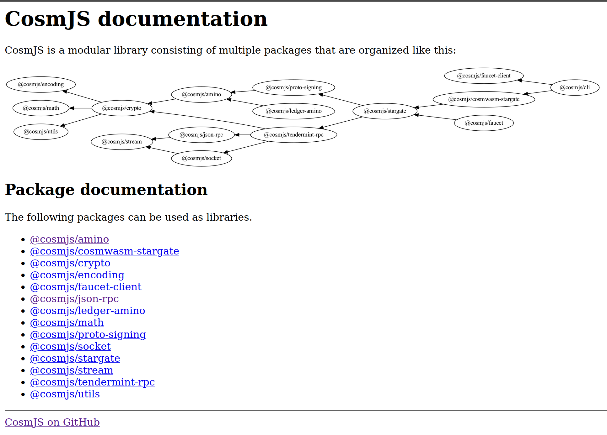
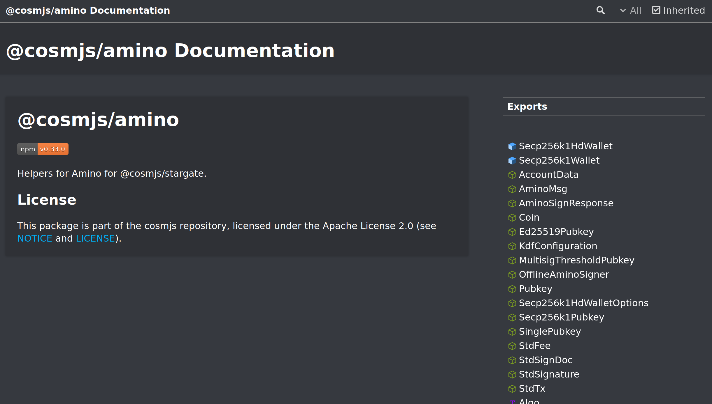
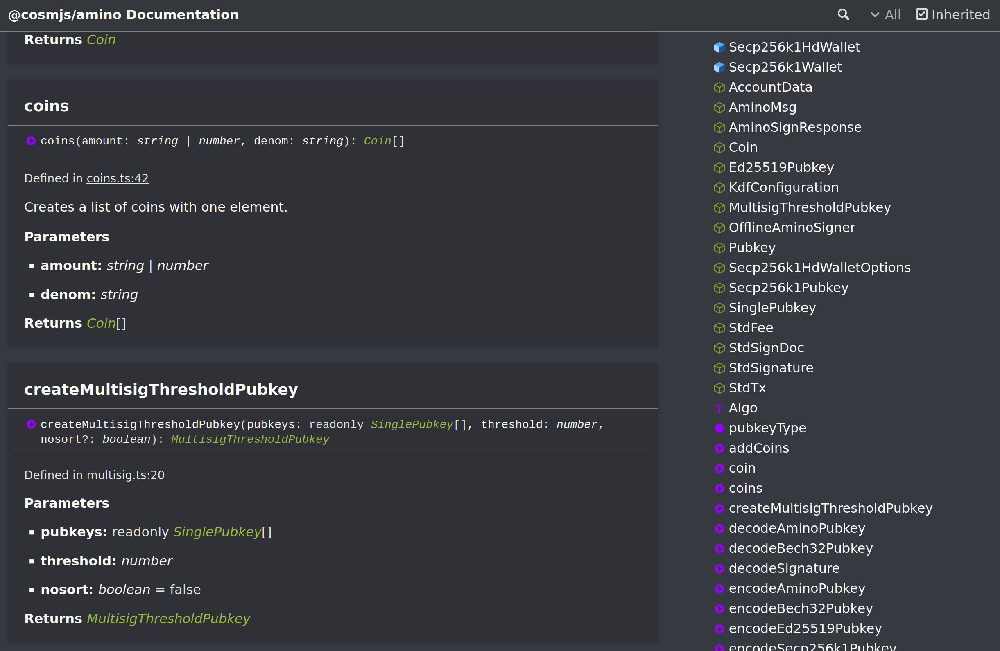

Sometimes, I get into an ecosystem, check out the standard library for development, and just think
to myself "wtf is this?" Frankly, this was one such occasion. At least when I started developing
this library, and at the time of writing, [CosmJS](https://cosmos.github.io/cosmjs/) is an absolute
chaos. Go ahead & click the link, I dare you. In case the documentation has finally been improved
by the time you read this, here's a screenshot:

Knowing nothing about the ecosystem yet, seeing this as the official "documentation" was not just
overwhelming, but utterly confusing. What are all these packages? Which one should I use to get
started communicating with my smart contracts? Clicking on one of these packages brought absolutely
no clarity. In fact, it just added to my bafflement:

And frankly, the documentations of the individual types and methods was barely any help either:

I felt lost. I didn't know where to start, or how to get started. So I went on a journey. And
literally learned how to build blockchains using the Cosmos SDK. Just to learn how to connect to my
smart contracts. I learned about Amino and ProtoBuf, I learned about Cosmos SDK build systems, its
messages and services, I learned the Go programming language just so I could read the Cosmos SDK
source code - because the Cosmos SDK documentation, albeit infinitely better, is still not
sufficiently documented and hard to search - I learned the protobuf wire format just to be able to
debug errors in my encoding.

**Everything I've learned is distilled into Apophis.** And I bring extensive experience in web
development.

I've built this SDK from scratch, targeting more modern ECMA standards to reduce footprint &
dependencies and improving interpretability of bundled code. For instance, we actually use bigints
as opposed to Uint53 strings, and Uint8Arrays instead of Buffers or - even worse - more strings. As
dependency hell is very real in the JS ecosystem, I've also made it a point to minimize the number
of dependencies, and to choose crypto libraries (scure and noble) that are well maintained by
independent active entities in the larger crypto industry as well as professionally audited. Apophis
also does not need polyfills and uses fetch instead of axios, so you don't need to configure your
build process to get it to work in the browser.

I've made it a point to focus on developer experience and time-to-dapp. I've made it a point to
simplify and normalize integration of new chains and SDK modules as much as I can. And I've made it
a point to write an actual documentation with a proper guide to how to get started ASAP. You can
even build a dapp in online editors like [codepen](https://codepen.io/) or
[codesandbox](https://codesandbox.io/) - no need for package managers, build steps, or bundlers!

And I really, really hate rudimentary generated code, or chained code generation. Such code often
suffers from low quality, redundancy, bloat, and is hard to simplify. Currently, a standard part of
CosmWasm smart contract development includes generating JSON schemas for your messages, and then
using those to generate TypeScript declarations. However, JSON schemas are not sophisticated enough
to distinguish between a string that resembles a serialized byte array, a stringified number, let
alone whether that byte array is base64 encoded or hex, or whether that number is a `Uint256` or a
`Decimal`. Thus, I will make it a point to build better code generation tools for protobuf types of
the Cosmos SDK and CosmWasm smart contracts.

While the JSON schemas we commonly generate from CosmWasm smart contracts is useful in its own
respect, these schemas have already lost information about the original types, simply because this
information cannot be expressed in JSON schemas. Accordingly, TypeScript generated from these
schemas cannot distinguish between a regular string and a stringified u64, or between a regular
string and a base64-encoded byte array, which leads to a degradation of developer experience.

Thus, the Apophis SDK was born.

It is still in its infancy, and its API is highly unstable. Nonetheless, I believe it already creates
a much more sensible abstraction than the prevailing library. The SDK has been written almost entirely
from scratch, currently using only the `cosmjs-types` package for Protobuf encoding, but even that
I intend to completely replace with a customized implementation.
